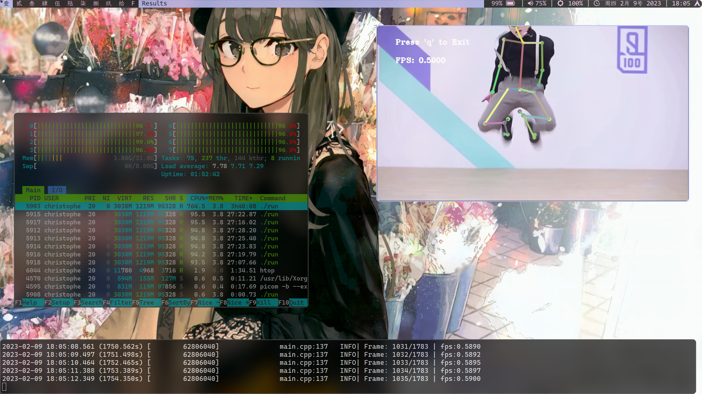
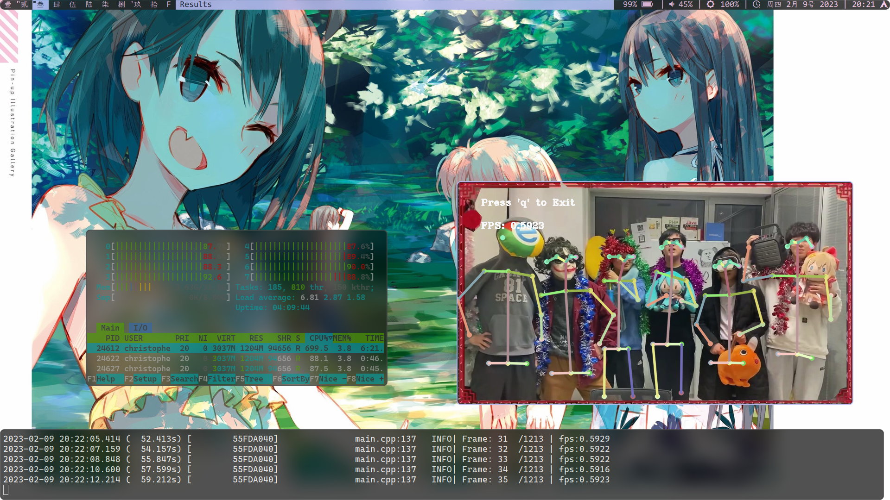

# OpenPose-OpenCV Demo

* 使用 OpenCV `cv::dnn` 模块调用 OpenPose 模型进行人体骨架识别。（可通过调整 `.xml` 文件来修改外部设置）。
* An encapsulation that demonstrates the usage of OpenCV **`cv::dnn`** on **OpenPOSE** to detect **Multiple** Human Pose.




## File Structure
```
.
├── build
├── CMakeLists.txt  -- CMake Stuff
├── conf            -- Configurations
│   └── ...
├── default.xml     -- Default Configuration
├── include         -- Read from Configurations
│   └── ...
├── LICENSE 
├── logsrc          -- Log Helper[1]
│   └── ...
├── main.cpp        -- Main Program
├── models          -- Models
│   └── ...
├── openpose        -- Encapsulated Opencv-OpenPose [2]
│   └── ...
├── README.md
└── sources         -- Example Images and Videos
    └── ...

32 directories, 116 files
```
> * \[1\]: Reference: `https://github.com/emilk/loguru`
> * \[2\]: Reference: `https://github.com/spmallick/learnopencv/tree/master/OpenPose-Multi-Person`

## Requirement
* OpenCV
* pthread (loguru requirement, other choices could be found in the [manual](https://github.com/emilk/loguru))
* wget and Access to the Internet (To download models)

## Usage
### Run Examples
```shell
# Download Models
./getModels.sh

mkdir build && cd build
cmake ..
make
./run -h # Check Program Usage
./run
```

### Coding APIs
* Copy `./openpose` directory
* Add following lines to CMakeLists.txt
```
INCLUDE_DIRECTORIES("./openpose")
ADD_SUBDIRECTORY("./openpose")
TARGET_LINK_LIBRARIES(run openpose)
# - `run` is the program names you define with `ADD_EXECUTABLE` command
# - `openpose` is the library name defined in `./openpose/CMakeLists.txt`
```

## Configurations
* Modify File `default.xml` for configurations

```
<?xml version="1.0"?>
<opencv_storage>
	<Settings>

		<!-- specify what kind of model was trained. It could be (COCO, BODY_25) depends on dataset. -->
		<dataset>BODY_25</dataset>
		<!-- model configuration, e.g. hand/pose.prototxt -->
		<modelTxt>./models/body_25/pose_deploy.prototxt</modelTxt>
		<!-- model weights, e.g. hand/pose_iter_102000.caffemodel -->
		<modelBin>./models/body_25/pose_iter_584000.caffemodel</modelBin>

		<!-- Preprocess input image by resizing to a specific widh. -->
		<W_in>368</W_in>
		<!-- Preprocess input image by resizing to a specific height. -->
		<H_in>368</H_in>

		<!-- threshold or confidence value for the heatmap -->
		<thresh>0.07</thresh>
		<!-- scale for blob -->
		<scale>0.003922</scale>

		<logPath>log.log</logPath>

		<!-- Could be (CPU, GPU) depends on devices and OpenCV Versions -->
		<device>CPU</device>

		<!-- Could be (CAM, IMAGE, VIDEO) -->
		<inputType>VIDEO</inputType>

		<!-- "*.png/jpg .etc" = Use Images -->
		<imageFile>./sources/group.jpg</imageFile>
		<!-- <outputPath>./output.png</outputPath> -->

		<!-- OutputPath is Necessary -->
		<videoFile>./sources/cxk.mp4</videoFile>
		<outputPath>./output.mp4</outputPath>

	</Settings>
</opencv_storage>
```

## Add Audio using `ffmpeg`
* Because OpenCV does not provide the audio features, the default output is muted without any audio. However, we can easily concatenate the audio from original input video on the output one to make the result sound.
```shell
ffmpeg -vn -i cxk.mp4 -i output.mp4 -y result_2.mp4

# - Options:
# 	-vn: No Video Frames is taken from `cxk.mp4`
# 	-i : Input File
# 	-y : Combine both
# - Legend:
# 	cxk.mp4   : Original Input File
# 	output.mp4: Output File without Audio
```

